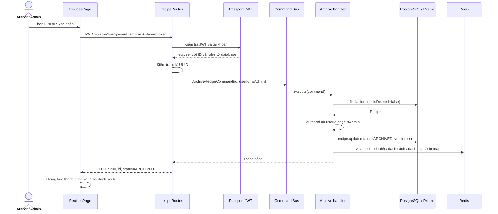

# Archive Recipe — triển khai, trình bày và chạy end-to-end

## 1. Kết quả chức năng

Archive chuyển công thức sang `ARCHIVED`. Danh sách và tìm kiếm công khai chỉ lấy `PUBLISHED`, nên công thức đã lưu trữ không xuất hiện. Bản ghi vẫn tồn tại, `isDeleted` vẫn là `false`; nội dung, nguyên liệu, bước nấu, ảnh và ngày xuất bản được giữ lại.

Author chỉ lưu trữ công thức của mình. Admin được lưu trữ công thức của mọi tác giả. Sau khi lưu trữ, chủ sở hữu/Admin vẫn xem được công thức trong trang quản lý và qua API chi tiết có JWT hợp lệ.

Gửi archive lần nữa vẫn trả 200, không tăng version thêm nếu trạng thái đã là Archived. Cả Draft và Published đều có thể chuyển sang Archived.

## 2. Các vấn đề trong mã cũ và cách hoàn thiện

- Đã có route `PATCH /:id/archive`, command và enum Archived, nhưng không có handler được đăng ký vào Command Bus.
- Middleware cũ của route archive trả `req.params.id` làm ID chủ sở hữu. Đây là ID công thức, nên so sánh với ID người dùng không thể xác định đúng tác giả.
- Chưa có handler cho danh sách, tìm kiếm và chi tiết Recipe.
- Bộ lọc danh sách chưa bắt buộc Published.
- Dashboard đang dùng phần danh sách giả lập và chưa có thao tác Archive.
- Giá trị phân trang từ URL là chuỗi, trong khi schema cũ chỉ nhận số.

Bản triển khai bổ sung handler, đăng ký trong DI container, kiểm tra chủ sở hữu dựa trên `recipe.authorId`, ép lọc Published tại query handler công khai, bổ sung trang quản lý và chuyển đổi chuỗi phân trang sang số.

Các route quản lý khác như tạo/sửa/publish/delete không thuộc thay đổi này.

## 3. Luồng thực thi



**Bước 1 — Giao diện:** `frontend/src/pages/RecipesPage.tsx` tải công thức theo quyền. Người dùng chọn Lưu trữ, đọc xác nhận và nhấn Xác nhận lưu trữ. Khi đang gửi yêu cầu, nút bị vô hiệu hóa; cờ `archiveInFlight` ngăn gửi trùng.

**Bước 2 — API client:** `frontend/src/lib/api.ts` gọi PATCH với Authorization Bearer. Client sử dụng cơ chế refresh token hiện có khi access token hết hạn. Thành công cập nhật giao diện; thất bại giữ hộp xác nhận và hiển thị lỗi để thử lại.

**Bước 3 — Route:** `backend/src/presentation/routes/recipeRoutes.ts` xác thực JWT, kiểm tra UUID, tạo command. Quyền Admin được lấy từ `req.user.roles`, không nhận từ body hay query do người gọi cung cấp.

**Bước 4 — Command Bus / DI:** `backend/src/presentation/di/container.ts` đăng ký `ArchiveRecipeCommandHandler` và các query handler. Command Bus điều phối tới handler.

**Bước 5 — Quyền và database:** `ArchiveRecipeCommandHandler.ts` tìm bản ghi chưa bị xóa. Không có thì trả 404. Nếu không phải Admin và khác tác giả thì trả 403. Khi được phép:

```ts
await prisma.recipe.update({
  where: {
    id: recipe.id,
    isDeleted: false,
    ...(!command.isAdmin ? { authorId: command.authorId } : {}),
  },
  data: {
    status: 'ARCHIVED',
    version: { increment: 1 },
  },
});
```

Prisma tự cập nhật `updatedAt` vì schema có `@updatedAt`. Không gọi delete, không cập nhật `isDeleted`, không sửa quan hệ con. Điều kiện owner được đưa vào update cho Author để tránh ghi vào công thức không còn thuộc người gọi.

**Bước 6 — Cache:** Sau khi update thành công, xóa `recipe:{id}`, `recipe:{slug}` và các nhóm `recipe:*`, `recipes:*`, `categories:*`, `sitemap:*`. Không invalidation khi database update thất bại. Yêu cầu archive lặp lại vẫn chạy invalidation.

Redis dùng service hiện có: khi Redis không kết nối, các thao tác cache là no-op; lỗi cache được service ghi log. Đây là invalidation theo cơ chế best effort của dự án, không phải transaction chung với PostgreSQL. Các query Recipe mới đọc trực tiếp database, nên không phụ thuộc Redis để lọc Archived.

**Bước 7 — Ẩn khỏi công khai:** `RecipeQueryHandlers.ts` bắt buộc `status: PUBLISHED` sau khi nhận bộ lọc, vì vậy gọi `?status=ARCHIVED` hoặc `?status=DRAFT` trên API công khai cũng không thể xem nội dung riêng. Cả items và totalCount dùng cùng điều kiện. API chi tiết trả 404 cho khách và người không có quyền khi công thức không Published.

## 4. API và mã phản hồi

| API | Mục đích |
| --- | --- |
| `PATCH /api/v1/recipes/{id}/archive` | Lưu trữ; cần JWT, owner hoặc Admin |
| `GET /api/v1/recipes/manageable` | Công thức được phép quản lý; Author chỉ thấy của mình, Admin thấy tất cả |
| `GET /api/v1/recipes/manageable?status=ARCHIVED` | Xem lại công thức đã lưu trữ |
| `GET /api/v1/recipes` | Chỉ Published |
| `GET /api/v1/recipes/search?q=Pho` | Tìm kiếm chỉ Published |
| `GET /api/v1/recipes/{slug}` | Công khai nếu Published; trạng thái khác cần owner/Admin |

`/manageable` được khai báo trước `/:slug` để không bị nhận nhầm thành slug.

| HTTP | Trường hợp |
| --- | --- |
| 200 | Archive thành công hoặc công thức đã Archived |
| 401 | Chưa đăng nhập, token không hợp lệ/hết hạn |
| 403 | Người gọi không phải owner/Admin |
| 404 | Công thức không tồn tại hoặc đã bị xóa |
| 422 | ID không phải UUID; dữ liệu bộ lọc/phân trang không hợp lệ |
| 500 | Lỗi database hoặc lỗi không dự kiến |

Response thành công:

```json
{
  "id": "<recipe UUID>",
  "status": "ARCHIVED",
  "message": "Recipe archived successfully"
}
```

## 5. Chạy dự án

Cấu hình hiện tại: backend `http://localhost:3000`, frontend `http://localhost:5173`; frontend `VITE_API_BASE_URL=http://localhost:3000/api/v1`.

1. PostgreSQL và Redis phải chạy theo `DATABASE_URL` và `REDIS_URL` của backend. Nếu dùng Docker Compose của dự án:

```powershell
cd D:\udptwnc\culinaryblog
docker compose up -d postgres redis minio mailhog
```

2. Terminal backend:

```powershell
cd D:\udptwnc\culinaryblog\backend
pnpm install
pnpm exec prisma generate
pnpm exec prisma migrate deploy
pnpm dev
```

Nếu dependencies và database đã sẵn sàng, chỉ cần `pnpm dev`. Tính năng này không đổi schema và không cần migration mới: enum ARCHIVED đã có sẵn.

3. Terminal frontend:

```powershell
cd D:\udptwnc\culinaryblog\frontend
pnpm install
pnpm dev
```

4. Mở `http://localhost:5173`, đăng nhập Author/Admin. Từ Dashboard chọn **Công thức**, hoặc mở `http://localhost:5173/dashboard/recipes`.

5. Chọn **Lưu trữ** trên một công thức, nhấn **Xác nhận lưu trữ**. Có thông báo thành công; công thức có nhãn **Đã lưu trữ** và không còn nút lưu trữ.

6. Chọn bộ lọc **Đã lưu trữ** để xem lại. Mở `http://localhost:5173/recipes` để đối chiếu danh sách công khai.

Nếu chưa có dữ liệu, dùng công thức đã có trong môi trường phát triển hoặc tạo fixture bằng Prisma Studio (`pnpm prisma:studio`): chọn category/author hợp lệ, điền các trường bắt buộc và trạng thái PUBLISHED. Bài test tích hợp bên dưới tự tạo/dọn fixture; không để lại công thức mẫu sau khi hoàn tất.

## 6. Thử API trực tiếp bằng PowerShell

Lấy access token từ response đăng nhập của tài khoản owner/Admin và UUID của công thức từ API quản lý. Không dùng slug ở endpoint archive.

```powershell
$apiBase = 'http://localhost:3000/api/v1'
$accessToken = '<access token>'
$recipeId = '<recipe UUID>'
$authHeaders = @{ Authorization = "Bearer $accessToken" }

Invoke-RestMethod -Method Get -Uri "$apiBase/recipes/manageable" -Headers $authHeaders
Invoke-RestMethod -Method Patch -Uri "$apiBase/recipes/$recipeId/archive" -Headers $authHeaders
Invoke-RestMethod -Method Get -Uri "$apiBase/recipes/manageable?status=ARCHIVED" -Headers $authHeaders
Invoke-RestMethod -Method Get -Uri "$apiBase/recipes"
```

Kiểm tra database bằng Prisma Studio hoặc SQL:

```sql
SELECT id, title, status, is_deleted, version, updated_at
FROM recipes
WHERE id = '<recipe UUID>';
```

Kỳ vọng: status = ARCHIVED, is_deleted = false; bản ghi và các quan hệ vẫn tồn tại.

## 7. Kiểm thử đã thực hiện

- Backend: 130 test đạt, bao gồm 14 test archive HTTP.
- Frontend: 98 test đạt, bao gồm 5 test mới của RecipesPage; đã chạy riêng 5 test này để xác nhận.
- Tích hợp thật: 1 test đạt với PostgreSQL, Passport JWT strategy và Redis thật. Test xác nhận cache được tạo rồi bị xóa sau archive, trạng thái thực trong database, dữ liệu con được giữ lại, owner/Admin có quyền và danh sách công khai bị ẩn.
- Build backend và frontend: thành công.
- `git diff --check`: đạt.

Chạy các test thông thường:

```powershell
cd D:\udptwnc\culinaryblog\backend
pnpm exec vitest run

cd D:\udptwnc\culinaryblog\frontend
pnpm test
```

Chạy tích hợp database/cache thật:

```powershell
cd D:\udptwnc\culinaryblog\backend
$env:RUN_RECIPE_ARCHIVE_E2E = '1'
pnpm exec vitest run tests/archiveRecipe.e2e.test.ts
Remove-Item Env:RUN_RECIPE_ARCHIVE_E2E
```

Test tích hợp yêu cầu database đã migrate và Redis đang chạy. Test chỉ tạo user/category/recipe có UUID riêng và dọn các bản ghi đó sau khi kết thúc. Invalidation sẽ xóa cache Recipe/danh mục/sitemap liên quan theo cùng hành vi archive của ứng dụng, nên nên chạy trong môi trường phát triển/test.

Các test giao diện dùng React Testing Library và fetch giả lập; test tích hợp HTTP dùng Supertest với database và Redis thật. Chưa có bài test điều khiển trình duyệt thật bằng Playwright.

## 8. Kịch bản trình bày

1. Giải thích mục tiêu: Archive ẩn công thức, giữ dữ liệu để quản lý về sau.
2. Mở danh sách công khai và trang quản lý; xác nhận công thức ban đầu Published.
3. Author chọn Lưu trữ. Trình bày hộp xác nhận, trạng thái chờ, thông báo thành công.
4. Mở Network, chỉ request PATCH, Bearer token và response 200.
5. Kiểm tra trang công khai: công thức đã biến mất. Chọn Đã lưu trữ trong quản lý: vẫn có.
6. Mở Prisma Studio/SQL: status ARCHIVED, isDeleted false; nguyên liệu, bước nấu, ảnh còn nguyên.
7. Trình bày kiểm thử 403 cho người khác, 200 cho Admin, và request lặp lại không tăng version.
8. Dùng sơ đồ ở mục 3 để giải thích vai trò của giao diện, route, Command Bus, handler, Prisma và cache.

Câu kết khi trình bày: “Chức năng chuyển trạng thái thay vì xóa dữ liệu; kiểm tra quyền ở backend; cập nhật database trước rồi vô hiệu hóa cache; truy vấn công khai chỉ cho phép Published.”
